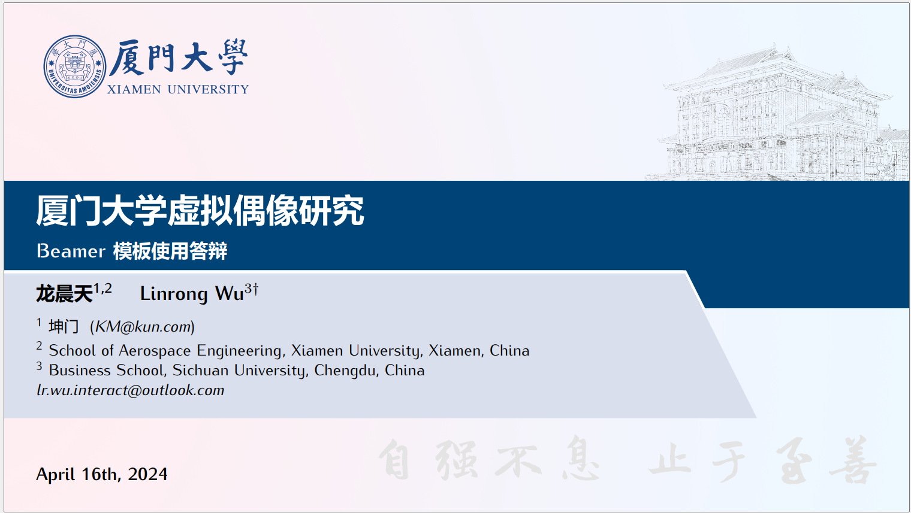
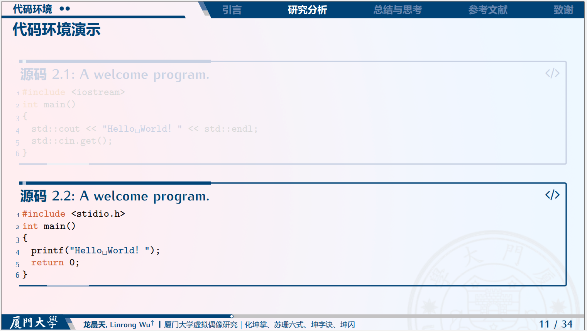
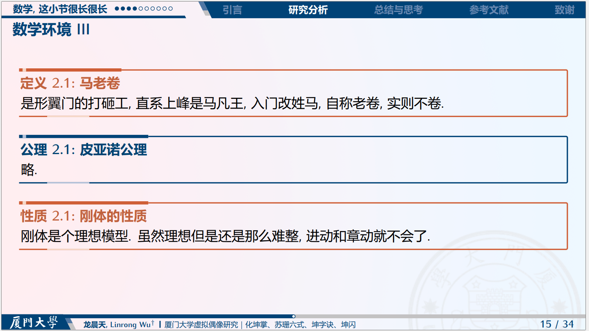
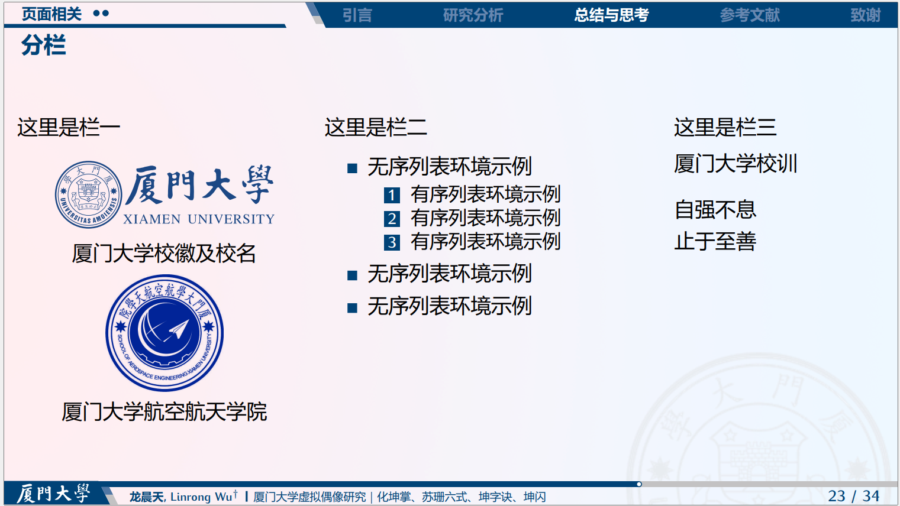
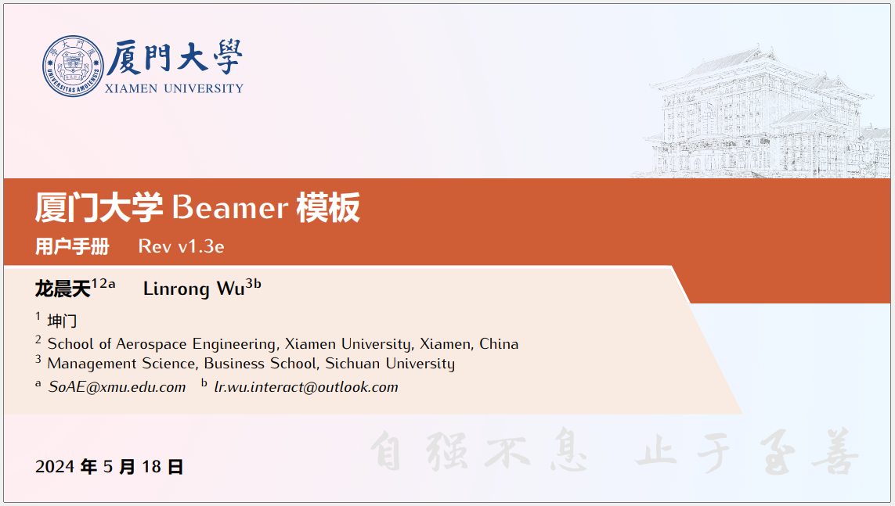
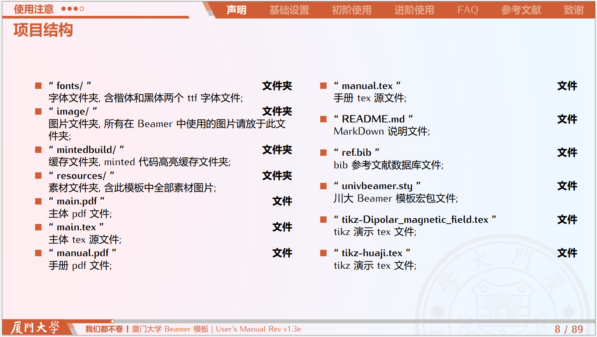
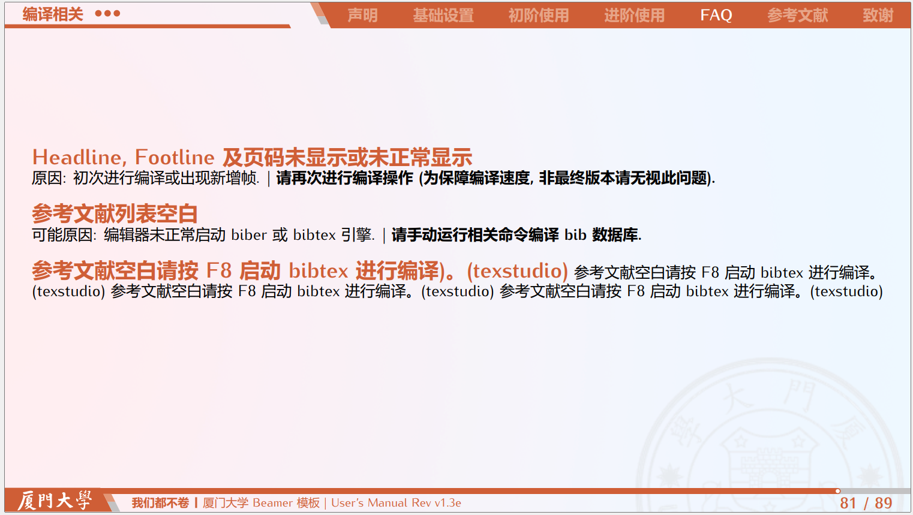

# 厦门大学Beamer模板

本项目参考了Beamer, Tcolorbox等官方文档, 参考了stackoverflow中的诸多问题；

主要参考了四川大学Beamer模板[SCU_Beamer_Slide-demo](https://github.com/FvNCCR228/SCU_Beamer_Slide-demo)

## 参考项目地址

-GitHub: https://github.com/FvNCCR228/SCU_Beamer_Slide-demo

-Gitee: https://gitee.com/NCCR/SCU_Beamer_Slide-demo

如果侵权了，请联系我删除

## 使用说明

- 请使用 `UTF-8` 格式, 设置 `XeLaTeX`和 `Biber` 进行编译( `main.tex` 或 `manual.tex` );

- 使用前请阅读用户手册;

- 对 LaTeX 不熟悉的情况下, 请勿轻易改动 `.sty` 文件(宏包文件)中代码, 也可按照文件中注释进行实验性修改(注意保留备份);

- 目前本模板仅在修改中者的 Windows 11 系统使用texstudio上编译通过；

- 背景修改，把`.\resources`里的文件中的图片替换了就行，目前弄了德旺图书馆的手绘图+建南大礼堂的手绘，请自行替换。

  

## 修改说明

### 配色

根据厦门大学百年校庆的视觉系统，嘉庚红/蓝替换了四川大学的锦绣红于宝石蓝。

厦大视觉系统太拉跨了，校徽是深蓝色的。

不是很好操作。

### 背景

德旺图书馆的手绘图。

建南大礼堂的手绘。

## 实例

## 致谢

非常感谢原作者`Linrong~Wu`贡献的模板，非常符合我对于latex做PPT的想象。

后面原作者有更新请看他/她的项目。

-GitHub: https://github.com/FvNCCR228/SCU_Beamer_Slide-demo

-Gitee: https://gitee.com/NCCR/SCU_Beamer_Slide-demo

本次学习就到此为止，该项目一般来说不会更新啦，如果侵权了，请联系我删除。

